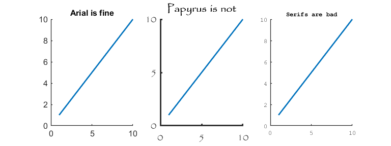

### Charts With Charles
This is an assortment of plotting functions (and a couple analysis functions too) to help with making nice plots in Matlab.

##### Example Plotting Functions
* [SetFont](Plotting/SetFont.m): Allows setting of all default font names and sizes available to the Matlab environment ([example](Plotting/html/PlottingExamples_01.png))
* [GetUnicodeChar](Plotting/GetUnicodeChar.m): Lookup function for unicode values
* [AlphaLine](Plotting/AlphaLine.m): A line graph with error denoted by a transparent box around the line ([example](Plotting/html/PlottingExamples_02.png))

* [Swarm](Plotting/Swarm.m): A function that allows for combinations of bee-swarm, violin, box and whisker ([example](Plotting/html/PlottingExamples_03.png))

