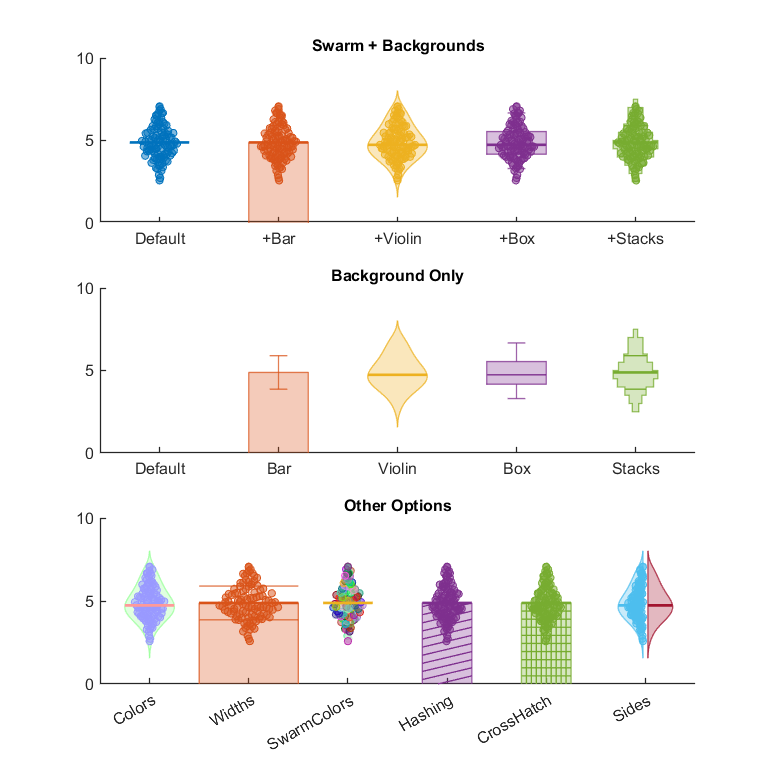

### Charts With Charles
This is an assortment of plotting functions (and a couple analysis functions too) to help with making nice plots in Matlab.

##### Current Plotting Functions
* [SetFont](Plotting/SetFont.m): Allows setting of all default font names and sizes available to the Matlab environment ([example](Plotting/html/PlottingExamples_01.png))
* [GetUnicodeChar](Plotting/GetUnicodeChar.m): Lookup function for unicode values
* [AlphaLine](Plotting/AlphaLine.m): A line graph with error denoted by a transparent box around the line ([example](Plotting/html/PlottingExamples_02.png))
* [Swarm](Plotting/Swarm.m): A function that allows for combinations of bee-swarm, violin, box and whisker ([example](Plotting/html/PlottingExamples_03.png))
* [OSScreenSize](Plotting/OSScreenSize.m): Uses pixel density info of screen to produce graphs of exact size in real units

##### Current Analysis Functions
* None: Sorry

##### Upcoming/Requested Plotting Functions
* GetAxisPadding: Grabs data and will set limits to the nearest desired value or percent
* CartesionPolarPlot: An implementation of the ShadedLine in in cartesian space
* MakeColorText: Allows rapid color setting of text
* Rasterfy: Takes spike times and creates a vector of x and y values to make a raster
* FoldedPSTH: Create a PSTH with error bars based on spike times

##### Upcoming/Requested Analysis Functions
* Vector Strength
* Harmonic Ratio
* Permutation Test
* Residual R2
